# Cálculo Diferencial – Notebook

Libreta para la materia de *Cálculo Diferencial*.

# Índice <a name="index">

1. [Unidad 1](#U1)
   1. [Números reales](#U1T1)
      1. [Distintos tipos de números](#U1T1S1)
      2. [Los números reales](#U1T1S2)
      3. [Axiomas y propiedades de los números reales](#U1T1S3)
      4. [Axiomas de los números reales](#U1T1S4)
      5. [Propiedades de los exponentes](#U1T1S5)
      6. [Errores comunes](#U1T1S6)
      7. [Intervalos](#U1T1S7)
      8. [Tipos de intervalos](#U1T1S8)
      9. [Unión e intersección de conjuntos](#U1T1S9)
      10. [Resta y complemento de conjuntos](#U1T1S10)
      11. [Inecuaciones (Desigualdades)](#U1T1S11)
      12. [Inecuaciones Lineales](#U1T1S12)
      13. [Inecuaciones Cuadráticas](#U1T1S13)
      14. [Inecuaciones Racionales](#U1T1S14)
      15. [Inecucaciones con valor absoluto](#U1T1S15)
   16. [Funciones](#U1T2)
       1. [Clasificación de las funciones](#U1T2S1)
       2. [Dominio de funciones](#U1T1S2)
       3. [Gráficas de funciones](#U1T2S3)
       4. [Gráficas y ecuaciones](#U1T2S4)
       5. [Gráficas importantes en cálculo](#U1T2S5)
       6. [Funciones definidas por partes](#U1T2S6)
       7. [Simetría](#U1T2S7)
       8. [Funciones crecientes o decrecientes](#U1T2S8)
       9. [Traslación de funciones](#U1T2S9)
       10. [Operaciones con funciones](#U1T2S10)
       11. [Composición de funciones](#U1T2S11)
       12. [Funciones Inversas](#U1T2S12)
       13. [Modelos Matemáticos](#U1T2S13)
       14. [Modelos Matemáticos Lineales](#U1T2S14)
       15. [Modelos Matemáticos Exponenciales](#U1T2S15)
       16. [Modelos Matemáticos Trigonométricos](#U1T2S16)
2. [Unidad 2](#U2)
   1. [Límites](#U2T1)
      1. [Límites de funciones](#U2T1S1)
      2. [Propiedades de los límites](#U2T1S2)
      3. [Límites laterales](#U2T1S3)
      4. [Límites infinitos](#U2T1S4)
      5. [Límites al infinito](#U2T1S5)
      6. [Límites importantes](#U2T1S6)
   2. [Continuidad](#U2T2)
3. [Unidad 3](#U3)
   1. [Derivación](#U3T1)
      1. [Definición de derivada](#U3T1S1)
      2. [Cálculo de la derivada con fórmulas](#U3T1S2)
      3. [Fórmulas de derivación](#U3T1S3)
      4. [Reglas de derivación](#U3T1S4)
      5. [Cálculo de derivadas](#U3T1S5)
      6. [Fórmulas adicionales de derivación](#U3T1S6)
      7. [Interpretación de la derivada](#U3T1S7)
      8. [La derivada como pendiente de recta tangente](#U3T1S8)
      9. [La derivada como razón de cambio](#U3T1S9)
      10. [Regla de la cadena](#U3T1S10)
      11. [Derivación Implícita](#U3T1S11)
      12. [Derivadas de orden superior](#U3T1S12)
      13. [Regla de L'Hopital](#U3T1S13)
      14. [Teorema de Rolle](#U3T1S14)
      15. [Teorema del valor medio](#U3T1S15)

# Unidad 1  <small>[:arrow_heading_up:](#index)</small>

## Númeroes Reales  <small>[:arrow_heading_up:](#index)</small>

### Distintos tipos de números  <small>[:arrow_heading_up:](#index)</small>

Todos estos conjuntos de números pertenecen a los **Reales** $(\Bbb{R})$:  

+ $\Large{\text{Naturales } (\Bbb{N}) \text{: } \{1, 2, 3, 4, 5, ...\}}$
+ $\Large{\text{Enteros } (\Bbb{Z}) \text{: } \{..., -3, -2, -1, 0, 1, 2, 3, ...\}}$
+ $\Large{\text{Racionales } (\Bbb{Q}) \text{: } \{..., {1 \over 3}, -{3 \over 4}, {21 \over 47}, 8, -{9 \over 2}, -3, ...\}}$
+ $\Large{\text{Irracionales } (\Bbb{I}) \text{: } \{\pi, e, \sqrt{2}, -\sqrt{3}, ...\}}$

> $\Bbb{N} \subset \Bbb{Z} \subset \Bbb{Q}$

### Los números reales  <small>[:arrow_heading_up:](#index)</small>

Debemos de tener cuidado al escribir los números reales.

+ **Expresiones Indefinidas**
   + ${3 \over 0}$
   + $\sqrt{-5}$
   + $0^{0}$
   + $(-1)^{3 / 4}$

+ **Expresiones Correctas**
   + ${0 \over 3}$ es correcto y es igual a $0$.
   + $\sqrt{0}$ es correcto y es igual a $0$.
   + $\sqrt{8}$ es correcto y es igual a $2.8284$.
   + $\sqrt[3]{-7}$ es correcto y es igual a $-1.9129$.

+ **Expresiones Incorrectas**
   + $\sqrt{2 + 3} = \sqrt{2} + \sqrt{3}$
   + $\sqrt{9} = \pm 3$
   + ${2 + \textcolor{red}{\cancel{\textcolor{white}{3}}} \over 5 + \textcolor{red}{\cancel{\textcolor{white}{3}}}} = {2 \over 5}$
   + $-2^{2} = 4$

+ **Expresiones con las que hay que tener cuidado**
   + $-x^{2} \textcolor{red}{\text{ no es lo mismo que }(-x)^{2}}$
   + ${5\textcolor{red}{\cancel{\textcolor{white}{x}}} \over \textcolor{red}{\cancel{\textcolor{white}{x}}}} = 5 \textcolor{red}{\text{ si } x = 0 \text{ la expresión es incorrecta}}$
   + $\sqrt{x^{2}} = 2 \textcolor{red}{\text{ si } x \text{ es negatival a expresión es incorrecta}}$

### Axiomas y propiedades de los números reales  <small>[:arrow_heading_up:](#index)</small>

Existen propiedades o leyes que cumplen los números reales. 

Para que una propiedad o ley sea válida, requiere demostrarse; aunque también existen algunas *propiedades tan fundamentales que solamente se toman como ciertas*.

> Un **axioma** es una ley que es cierta por sí misma, es decir, no necesita demostración. Por ejemplo: *El axioma de la conmutatividad de la suma*:

$$
3 + 5 = 5 + 3
$$

> Un **teorema o propiedad** es una ley cuya veracidad ya ha sido demostrada. Por ejemplo: *Las leyes de los signos*:

$$
(-)(-) = (+) \\
(-)(+) = (-) \\
(+)(-) = (-) \\
(+)(+) = (+)
$$

### Axiomas de los números reales  <small>[:arrow_heading_up:](#index)</small>

+ **Para la suma:**
  + *Cerradura*
  Si $a \in \Bbb{R}$ entonces $a + b \in \Bbb{R}$
  + *Asociativa*
  $(a+b)+c = a+(b+c)$
  + *Neutro*
  $a + 0 = a$
  + *Inverso*
  $a - a = 0$
  + *Conmutativa*
  $a + b = b + a$

+ **Para la multiplicación:**
  + *Cerradura*
  Si $a \in \Bbb{R}$ entonces $ab \in \Bbb{R}$
  + *Asociativa*
  $(ab)c = a(bc)$
  + *Neutro*
  $a(1) = a$
  + *Inverso*
  $a({1 \over a}) = 1$
  + *Conmutativa*
  $ab = ba$
 
### Propiedades de los exponentes  <small>[:arrow_heading_up:](#index)</small>

**Definición:** Si $a \in \Bbb{R}$ y $n \in \Bbb{N}$ entonces:

$$
a^{n} = \underbrace{(a)(a)(a)\dots(a)}_{n \text{ veces}}
$$

+ **Propiedades**
  1. $a^{0} = 1$ <small>, si $a \not = 0$</small>
  2. $a^{-n} = {1 \over a^{n}}$ y también $a^{n} = {1 \over a^{-n}}$
  3. $a^{m}a^{n} = a^{m+n}$
  4. ${a^{m} \over a^{n}} = a^{m-n} = {1 \over a^{n-m}}$
  5. $(a^{m})^{n} = a^{mn}$
  6. $(ab)^{n} = a^{n}b^{n}$
  7. $({a \over b})^{n} = {a^{n} \over b^{n}}$
  8. $({a \over b})^{-n} = ({b \over a})^{n} = {b^{n} \over a^{n}}$
  9. ${a^{-m} \over b^{-n}} = {b^{n} \over a^{m}}$

### Errores comunes  <small>[:arrow_heading_up:](#index)</small>

+ $(a+b)^{2} = a^{2} + b^{2}$ La potencia no se distribuye. Lo correcto es $(a+b)^{2}=a^{2}+2ab+b^{2}$
+ $\sqrt{a+b} = \sqrt{a} + \sqrt{b}$ La raíz no se distribuye
+ $\sqrt{a^{2}+b^{2}} = a + b$ La raíz no se distribuye
+ ${1 \over a} + {1 \over b} = {1 \over a + b}$ Así no se suman las fracciones. Lo correcto es ${1 \over a} + {1 \over b} = {b + a \over ab}$
+ ${a+b \over a} = b$ La $a$ no se puede cancelar arriba y abajo cuando se trata de una suma. Sólo se puede cancelar arriba y abajo cuando se trata de una multiplicacón, y cuando $a \not = 0$. Ejemplo ${ax \over a}=x$.

### Intervalos  <small>[:arrow_heading_up:](#index)</small>

Un **conjunto** es una colección de objetos.
Si $A$ es el conjunto de números naturales menores que 5 entonces: 
+ $A=\{1,2,3,4\}$, $3 \in A$ y $8 \notin A$
+ $A$ tiene 4 elementos, donde $8 \notin A$

> Los números reales $R$ suelen representarse mediante una recta numérica llamada **recta real**.

Si $B$ es el conjunto de números reales que son mayores que 2 y menores que 5, entonces $B = (2,5) = \{x \in \Bbb{R} \space | \space 2 < x < 5\}$. $B$ tiene una infinidad de elementos porque es un **intervalo**.

### Tipos de intervalos  <small>[:arrow_heading_up:](#index)</small>

| Notación | Descripción |
| :------: | :---------: |
| $(a,b)$  | $\{x \in \Bbb{R} \space | \space a < x < b\}$ |
| $[a,b]$  | $\{x \in \Bbb{R} \space | \space a ≤ x ≤ b\}$ |
| $[a,b)$  | $\{x \in \Bbb{R} \space | \space a ≤ x < b\}$ |
| $(a,b]$  | $\{x \in \Bbb{R} \space | \space a < x ≤ b\}$ |
| $(a,\infin)$ | $\{x \in \Bbb{R} \space | \space a < x\}$ |
| $[a, \infin)$ | $\{x \in \Bbb{R} \space | \space a ≤ x\}$ |
| $(-\infin, b)$ | $\{x \in \Bbb{R} \space | \space x < b\}$ |
| $(-\infin, b]$ | $\{x \in \Bbb{R} \space | \space x ≤ b\}$ |
| $(-\infin, \infin)$ | $\Bbb{R}$ |
 
### Unión e intersección de conjuntos  <small>[:arrow_heading_up:](#index)</small>

+ La **unión** de dos conjuntos $A$ y $B$ es el conjunto que tiene a los elementos que están en $A$ ó que están en $B$. Se denota: $\textcolor{#39bf5d}{A \cup B}$.

+ La **intersección** de dos conjuntos $A$ y $B$ es el conjunto que tiene a los elementos que están en $A$ y que están en $B$. Se denota: $\textcolor{#39bf5d}{A \cap B}$.

### Resta y complemento de conjuntos  <small>[:arrow_heading_up:](#index)</small>

+ La **resta (o diferencia)** de conjuntos $B$ menos $A$ es el conjunto de los elementos que están en $B$ pero que no están en $A$. Se denota: $\textcolor{#39bf5d}{B - A}$.

+ El **complemento** del conjunto $A$ es el conjunto de elementos del conjunto universo $U$ que no están en $A$. Se denota: $\textcolor{#39bf5d}{A^{c}}$.

Ejemplo, si $A = (2,3]$ y $B = (1,9)$, entonces:

$$
\begin{aligned}
B - A &= (1,2] \cup (3,9) \\
A - B &= \varnothing \\
A^{c} &= (-\infin, 2] \cup (3, \infin) \\
B^{c} &= (-\infin, 1] \cup [9, \infin)
\end{aligned}
$$

### Inecuaciones (Desigualdades)  <small>[:arrow_heading_up:](#index)</small>

Una **inecuación** es una expresión matemática que contiene una desigualdad. Resolver una inecuación se refiere a encontrar el conjunto de todos los números reales que satisfacen la desigualdad dada. Este conjunto se llama *conjunto solución*.

> Un ejemplo de una inecuación es: $4x - 3 < x +6$

Para resolver inecuaciones utilizamos las siguientes propieades de las desigualdades:

**Despejes**
+ Si $x \textcolor{#c6423b}{+ A} ≥ B$ entonces $x ≥ B \textcolor{#c6423b}{- A}$
+ Si $\textcolor{#c6423b}{A}x ≥ B$ y $\textcolor{#c6423b}{A}$ es positivo, entonces $x ≥ {B \over \textcolor{#c6423b}{A}}$
+ Si $\textcolor{#c6423b}{A}x ≥ B$ y $\textcolor{#c6423b}{A}$ es negativo entonces $x ≤ {B \over \textcolor{#c6423b}{A}}$

**Cancelaciones**
+ Si $x + \textcolor{#c6423b}{A} ≥ y + \textcolor{#c6423b}{A}$ entonces $x ≥ y$
+ Si $\textcolor{#c6423b}{A}x ≥ \textcolor{#c6423b}{A}y$ y $\textcolor{#c6423b}{A}$ es positivo entonces $x ≥ y$
+ Si $\textcolor{#c6423b}{A}x ≥ \textcolor{#c6423b}{A}y$ y $\textcolor{#c6423b}{A}$ es negativo entonces $x ≤ y$

**Recíprocos**
+ Si $\textcolor{#c6423b}{A}$ y $\textcolor{#c6423b}{B}$ son positivos y $\textcolor{#c6423b}{A} ≥ \textcolor{#c6423b}{B}$ entonces ${1 \over \textcolor{#c6423b}{A}} ≤ {1 \over \textcolor{#c6423b}{B}}$

### Inecuaciones Lineales  <small>[:arrow_heading_up:](#index)</small>

Consideremos la inecuación $4x - 3 < x + 6$

El número $x = 5$ no satisface la desigualdad porque al sustituir obtenemos

$$
4(5) - 3 < (5) + 6 \\
\textcolor{red}{17 < 11}
$$

El número $x = 1$ sí satisface la desigualdad porque al sustituir obtenemos

$$
4(1) - 3 < (1) + 6 \\
\textcolor{green}{1 < 7}
$$

Resolvamos la inecuación:

$$
\begin{aligned}
4x - 3 &< x + 6 \\
4x - x &< 3 + 6 \\
3x &< 9 \\
x &< {9 \over 3} \\
x &< 3
\end{aligned}
$$

El conjunto solución está gormado por todos los números reales menores que 3.

$$
(-\infin, 3) = \{x \in \Bbb{R} \space | \space x < 3\}
$$

### Inecuaciones Cuadráticas  <small>[:arrow_heading_up:](#index)</small>

Resolvamos la inecuación:

$$
x^{2} - x - 12 < 0
$$

Solución:

1. Primero resolvemos la ecuación $x^{2} - x - 12 = 0$

$$
(x-4)(x+3) = 0 \rArr 
\begin{cases}
x = 4 \\
x = -3
\end{cases}
$$

2. Ahora dividimos la recta real con las soluciones obtenidas y evaluamos en cada intervalo algún número, para descubrir cuáles son parte de la solución:

+ Probemos con $-4$

$$
\begin{aligned}
x^{2} - x - 12 &< 0 \\
(-4)^{2} - (-4) - 12 &< 0 \\
16 + 4 - 12 &< 0 \\
8 &< 0 \\ 
\end{aligned} \\
\textcolor{red}{\text{El interavalo } (-\infin, -3) \text{ no es parte de la solución}}
$$

+ Probemos con $0$

$$
\begin{aligned}
x^{2} - x - 12 &< 0 \\
0 - 0 - 12 &< 0 \\
-12 &< 0 \\
\end{aligned} \\
\textcolor{green}{\text{El intervalo } (-3,4) \text{ sí es parte de la solución}}
$$

+ Probemos con $5$

$$
\begin{aligned}
x^{2} - x - 12 &< 0 \\
(5)^{2} - (5) - 12 &< 0 \\
25 - 5 - 12 &< 0 \\
8 < 0 \\
\end{aligned} \\
\textcolor{red}{\text{El intervalo } (4, \infin) \text{ no es parte de la solución}} \\
\ \\
\therefore \text{La solución es } (-3, 4)
$$

### Inecuaciones Racionales  <small>[:arrow_heading_up:](#index)</small>

Resolvamos la inecuación:

$$
{x - 2 \over x - 4} ≥ 0
$$

Solución:

1. Hallamos los números que anulen al numerador y al denominador

$$
x - 2 = 0 \rArr x = 2
$$

> Los números que anulan al numerador serán parte de la solución si la desigualdad (estricta o no estricta) lo permite

$$
x - 4 = 0 \rArr x = 4
$$

> Los números que anulan al denominador no serán parte de la solución

2. Dividimos la recta real con ellos y probamos los intervalos

+ Probemos con $1$

$$
{1 - 2 \over 1 - 4} = {-1 \over -3} = + {1 \over 3} ≥ 0 \\
\textcolor{green}{1 \text{ sí es respuesta}}
$$

+ Probemos con $3$

$$
{3 - 2 \over 3 - 4} = {1 \over -1} = -1 ≥ 0 \\
\textcolor{red}{3 \text{ no es respuesta}}
$$

+ Probemos con $5$

$$
{5 - 2 \over 5 - 4} = {3 \over 1} = +3 ≥ 0 \\
\textcolor{green}{5 \text{ sí es respuesta}}
$$

$$
\text{La solución es: } (-\infin, 2] \cup (4, \infin)
$$

### Inecuaciones con valor absoluto  <small>[:arrow_heading_up:](#index)</small>

Para resolver una inecuación con valor absoluto usamos las siguientes propiedades:

1. Si $|A| ≤ c$ entonces $-c ≤ A ≤ c$ o también se puede escribir $(-c ≤ A) \land (A ≤ c)$
2. Si $|A| ≥ c$ entonces $(A ≥ c) \lor (A ≤ -c)$

**Ejemplo:** Resolver $|x-3| < 5$

**Solución:**

$$
-5 < x -3 < 5 \\
-5 + 3 < x - 3 + 3 < 5 + 3 \\
\boxed{-2 < x < 8}
$$

El conjunto solución está formado por todos los números reales mayores que $-2$ y menores que $8$.

$$
(-2,8) = \{x \in \Bbb{R} \space | \space -2 < x < 8\}
$$

**Ejemplo:** Resolver $|2x + 6| ≥ 12$

**Solución:**

$$
2x + 6 ≥ 12 \\
2x ≥ 6 \\
x ≥ 3
$$

$$
\textcolor{gold}{\text{ó}}
$$

$$
2x + 6 ≤ -12 \\
2x ≤ -18 \\
x ≤ -9
$$

La solución es: $(-\infin, -9] \textcolor{gold}{\cup} [3, \infin)$

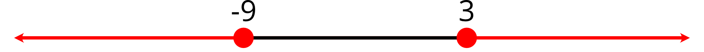

> La solución queda unida ($\cup$) porque hay dos posibilidades para resolver una inecuación de valor absoluto.

## Funciones  <small>[:arrow_heading_up:](#index)</small>

Una **función** $f$ es una regla que asigna a cada número $x$ de un conjunto llamado **Dominio**, algún número $f(x)$ de un conjunto llamado **Contradominio**. La **imagen** (o **Rango**) de $f$ es el conjunto que resulta al evaluar todos los números del Dominio; es un subconjunto del contradominio.

### Clasificación de las funciones  <small>[:arrow_heading_up:](#index)</small>

Las funciones pueden ser:

+ Lineales $f(x) = 3x -8$
+ No Lineales
  + Cuadráticas $f(x) = 5x^{2} + 4x -1$
  + Cúbicas $f(x) = 2x^{3} - x^{2} + 9$
  + Racionales $f(x) = {x^{3} + x - 5 \over 8x^{2} - 4x + 1}$
  + Logarítmicas $f(x) = log_{3}(x) \space | \space g(x) = ln(x)$
  + Exponenciales $f(x) = 4^{x} \space | \space g(x) = e^{x}$
  + Trigonométricas $f(x) = 5cos(x)$

### Dominio de funciones  <small>[:arrow_heading_up:](#index)</small>

El Dominio de una función está definido por la regla de asignación y/o las aplicaciones de la función. Muchas veces suele no escribirse pero está ahí.

**Ejemplo:** 

$$
f(x) = \sqrt{x-3}
$$

> Al escribir esta función no se ha escrito el Dominio, pero podemos averiguar cuál es, ya que el Dominio son todos los númeroes que se pueden evaluar en la función.

### Gráficas de funciones  <small>[:arrow_heading_up:](#index)</small>

Las funciones se pueden graficar evaluando algunos puntos y representándolos en el plano cartesiano. Este proceso suele llamarse **tabulación**.

**Ejemplo:** Graficar la función $f(x) = x^{2} - 3$

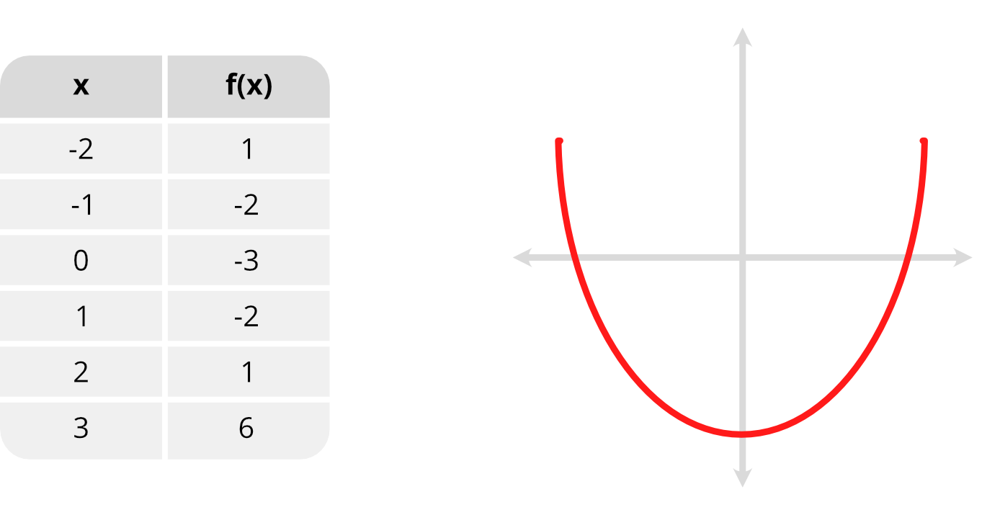

Dada una gráfica de una función $f(x)$, podemos conocer las evaluaciones de algunos números $x$, aunque qui´zas nunca logremos conocer qué función $f(x)$ es.

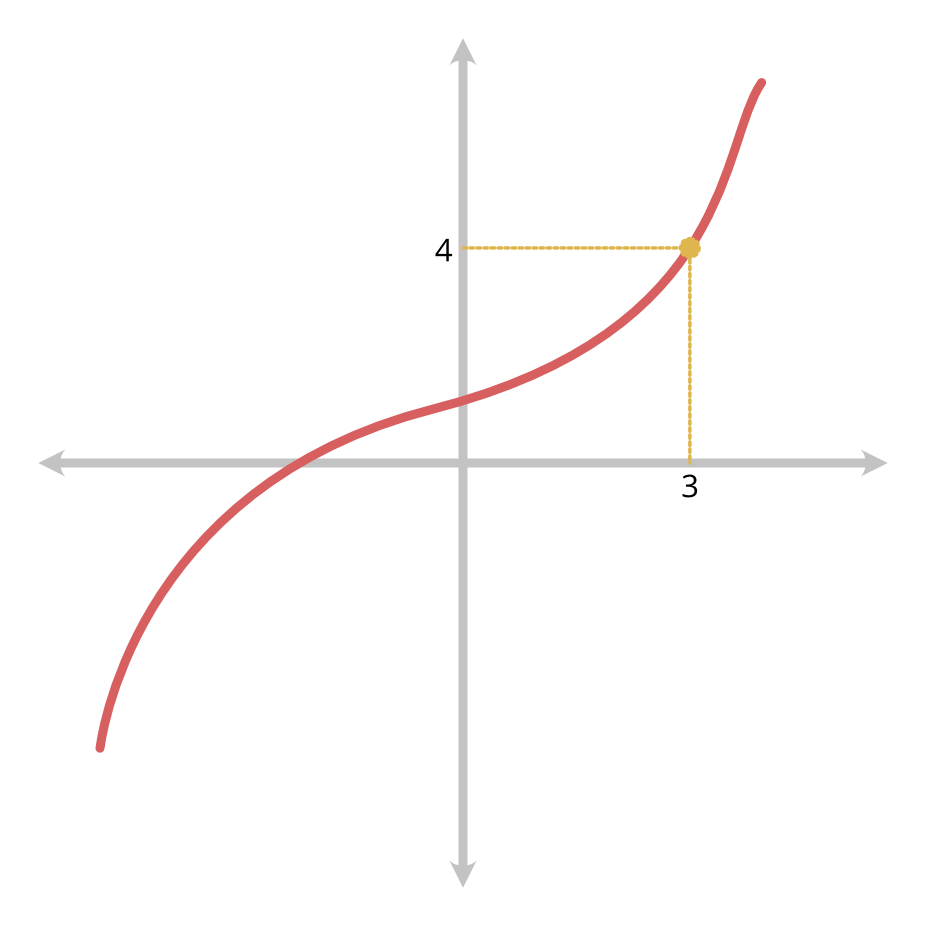

### Gráficas y ecuaciones  <small>[:arrow_heading_up:](#index)</small>

Una función y una ecuación no son lo mismo, aunque ambas se puedan graficar (tabulando) e incluso podrían tener la misma gráfica.

**Ejemplo:** $f(x) = x^{3}$ y $y = x^{3}$ tienen la misma gráfica

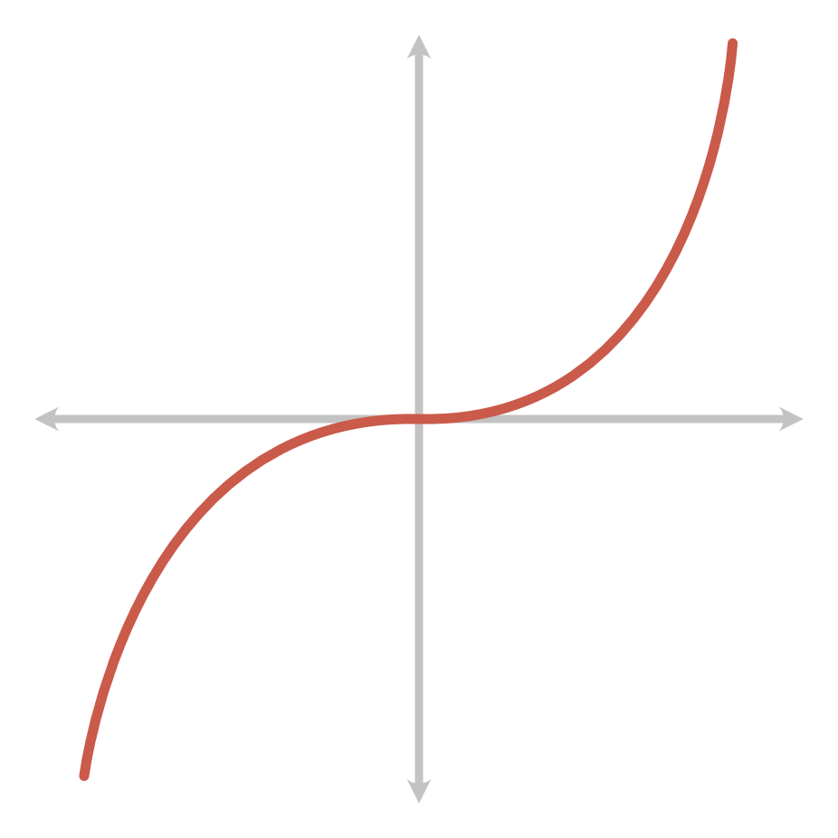

Para saber si una gráfica corresponde a una función o a una ecuación suele aplicarse la *prueba de la recta vertical:* Si en cualquier punto se traza una prueba vertical y ésta corta 2 o más veces a la gráfica, entonces la gráfica no corresponde a una función, sino a una ecuación.

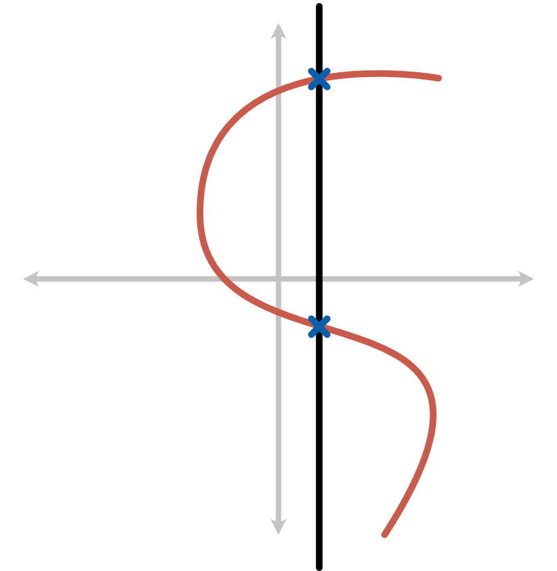

### Gráficas importantes en cálculo  <small>[:arrow_heading_up:](#index)</small>

Algunas gráficas que se utilizan son comúnmente para resolver límites, optimización, etc. son:

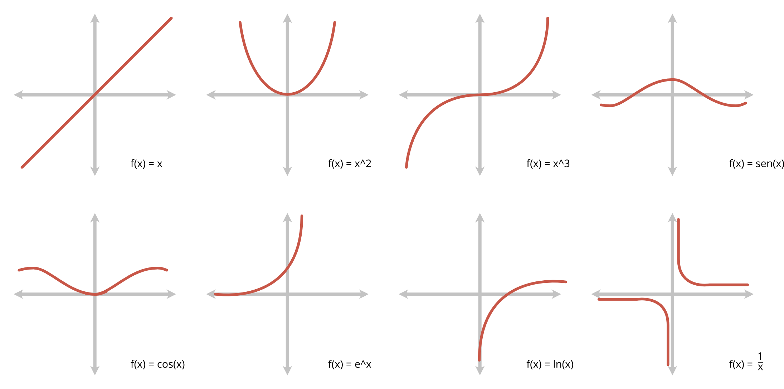

### Funciones definidas por partes  <small>[:arrow_heading_up:](#index)</small>

Algunas veces la funciones estarán definidas por diferentes fórmulas en diferentes partes de su dominio.

**Ejemplo:**

$$
f(x) = 
\begin{cases}
1 - x \text{ si } x ≤ 1 \\
x^{2} \text{ si } x > 1
\end{cases}
$$

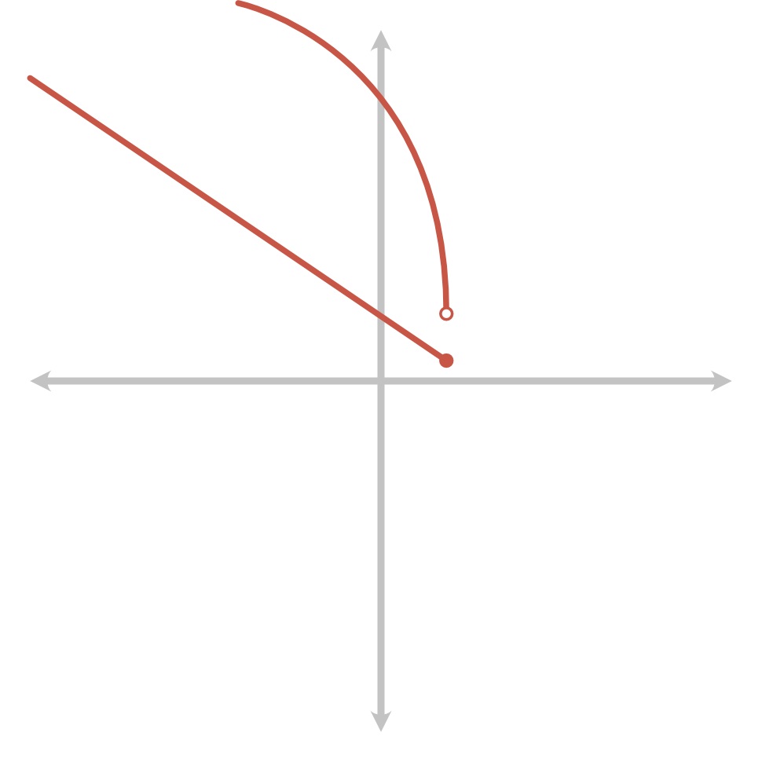

### Funciones Definindas por partes

**Ejemplo:** La función de valor absoluto

$$
f(x) =
\begin{cases}
x \text{ si } x ≥ 0 \\
-x \text{ si } x < 0
\end{cases}
$$

### Simetría  <small>[:arrow_heading_up:](#index)</small>

+ Una **función par** es aquella que cumple $f(-x) = f(x)$
+ Una **función impar** es aquella que cumple $f(-x) = -f(x)$

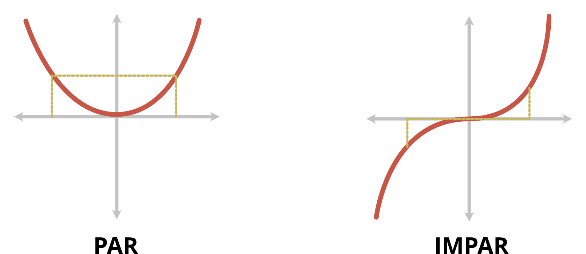

### Funciones crecientes o decrecientes  <small>[:arrow_heading_up:](#index)</small>

+ Una función $f$ es **creciente** si $f(a) < f(b)$ cuando $a < b$
+ Una función $f$ es **drecreciente** si $f(a) > f(b)$ cuando $a < b$

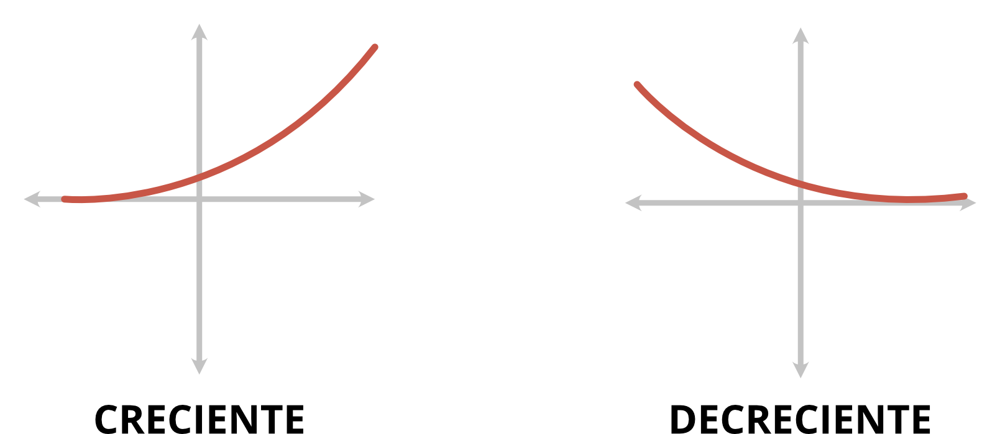

> Una funcón podría ser creciente en un intervalo y decreciente en otro.

### Traslación de funciones  <small>[:arrow_heading_up:](#index)</small>

Si se conoce la gráfica de una función $f(x)$, ésta se puede trasladar horizontal o verticalmente $c$ unidades $(c > 0)$

Dada la función $y = f(x)$:

+ $y = f(x) + c$ La gráfica se traslada $c$ unidades hacia arriba
+ $y = f(x) - c$ La gráfica se traslada $c$ unidades hacia abajo
+ $y = f(x-c)$ La gráfica se traslada $c$ unidades a la derecha
+ $y = f(x+c)$ La gráfica se traslada $c$ unidades a la izquierda

### Operaciones con funciones  <small>[:arrow_heading_up:](#index)</small>

Las funciones se pueden sumar, restar, multiplicar o dividir.

Sean $f(x)$ y $g(x)$ funciones reales. Entonces se definen las siguientes operaciones:

$$
\begin{aligned}
(f+g)(x) &= f(x) + g(x) \\
(f-g)(x) &= f(x) - g(x) \\
(fg)(x) &= f(x)g(X) \\
(f/g)(x) &= {f(x) \over g(x)}
\end{aligned}
$$

### Composición de funciones  <small>[:arrow_heading_up:](#index)</small>

Sean $f(x)$ y $g(x)$ funciones reales. La **composición** (de ser posible) se define:

$$
(f \circ g)(x) = f(g(x))
$$

**Ejemplo:** Sean $f(X) = x^{2} + 1$ y $g(x) = 3x$

$$
(f \circ g)(2) = f(g(2)) = f(6) = 37
$$

> Para el dominio de una composición de funciones se tienen que contemplar todos los valores que funcionen sin ningun problema en todas las funciones. Si algún valor no sirve para una de las funciones, entonces quedará fuera del Dominio.

### Funciones inversas  <small>[:arrow_heading_up:](#index)</small>

Dos funciones $f(x)$ y $g(x)$ son **inversas** una de la otra si (con los dominios adecuados)

$$
(f \circ g)(x) = x \text{ y } (g \circ f)(x) = x
$$

La función inversa de $f(x)$ se denota $f^{-1}(x)$

> Esto quiere decir que si una función tiene el efecto "opuesto" al de la otra, tales funciones son inversas.

### Modelos Matemáticos  <small>[:arrow_heading_up:](#index)</small>

Un  **modelo matemático** es una descripción matemática (a menudo por medio de una función o una ecuación) de un fenómeno real, como el tamaño de una población, la demanda de un producto, la velocidad de un objeto que cae, la concentración de un producto en una reacción química, la esperanza de vida de una persona al nacer, o el costo de la reducción de las emisiones. El propósito del modelo es comprender el fenómeno y tal vez hacer predicciones sobre su comportamiento futuro.

Según el tipo de función (o ecuación) el modelo podría ser lineal, cuadrático, exponencial, lograítmico, trigonométrico, no lineal, etc.

### Modelos Matemáticos Lineales  <small>[:arrow_heading_up:](#index)</small>

**Ejemplo** Cuando el aire seco se mueve hacia arriba, se expande y se enfría.
Desearíamos hallar un modelo lineal que describa la temperatura $T$ (en ºC) del aire a una altura $h$ (en km).

$$
T = Ah + B
$$

> Esto es un modelo lineal

### Modelos Matemáticos Exponenciales  <small>[:arrow_heading_up:](#index)</small>

**Ejemplo:** Un tazón de sopa caliente se enfría de acuerdo a la Ley de Enfriamento de Newton, de modo que la temperatura en el tiempo $t$ es:

$$
T(t) = 65 + 145e^{-0.05t}
$$

> Esto es un modelo exponencial

### Modelos Matemáticos Trigonométricos  <small>[:arrow_heading_up:](#index)</small>

**Ejemplo:** Si un terremoto tiene un desplazamiento horizontal total de $S$ metros a lo largo de su línea de falla, entonces el movimiento horizontal $M$ (en metros) de un punto en la superficie de la Tierra a $d$ kilómetros de la línea de falla se puede calcular usando la fórmula.

$$
M = {S \over 2}(1 - {2 \over \pi}arctan({d \over D}))
$$

> Esto es un modelo trigonométrico

# Unidad 2  <small>[:arrow_heading_up:](#index)</small>

Objetivo de la unidad

<markdown>
Resuelve problemas matemáticos mediante la aplicación de límites y continuidad, con el uso de los diferentes registros de representación mediante herramientas tecnológicas.
</markdown>

## Límites  <small>[:arrow_heading_up:](#index)</small>

Para la matemática, un límite es una magnitud a la que se acercan progresivamente los términos de una secuencia infinita de magnitudes. Un límite matemático, por lo tanto, expresa la tendencia de una función o de una sucesión mientras sus parámetros se aproximan a un cierto valor.

### Límites de funciones  <small>[:arrow_heading_up:](#index)</small> 

Dada una función $f$, nos interesará conoce el comportamiento de los valores $f(x)$ obtenidos al evaluar números cercanos a $x = a$.

Por ejemplo, si $f(x) = 3x$ y evaluamos números cercanos (por ambos lados) a $x = 2$ obtenemos:

|   x   |    f(x)    |
|:-----:|:----------:|
|  1.9  |     5.7    |
|  1.99 |    5.97    |
| 1.999 |    5.997   |
|   $\textcolor{red}{2}$   | $\textcolor{red}{6 \text{ *No evaluar}}$ |
| 2.001 |    6.003   |
|  2.01 |    6.03    |
|  2.1  |     6.3    |

Notamos que al evaluar en $f(x) = 3x$ números cercanos a $x = 2$, los valores se acercan a $6$. Este comportamiento se denota $\lim\limits_{x \to 2} 3x = 6$

Decimos que una función $f$ tiene límite $L$, cuando $x$ tiende a $a$. Esto se denota:

$$
\lim\limits_{x \to a} f(x) = L
$$

Esto significa que al evaluar en la función $f(x)$ números cercanos (por ambos lados) al número $a$, los valores se acercan a $L$.

Resolver un límite como $\lim\limits_{x \to a} f(x)$ significa hallar (si es que existe) el número $L$ al que se acercan los valores de $f(x)$ cuando evaluamos números cercanos al números $a$ (por ambos lados).

**Ejemplo:** Resolver $\lim\limits_{x \to 2} {x^{2} - 5x + 6 \over x - 2}$

|   x   |  f(x)  |
|:-----:|:------:|
|  1.9  |  -1.11 |
|  1.99 |  -1.01 |
| 1.999 | -1.001 |
|   2   |    ?   |
| 2.001 | -0.999 |
|  2.01 |  -0.99 |
|  2.1  |  -0.9  |

> En este ejemplo no se puede resolver el límite simplemente evaluando el 2 (porque no se puede evaluar el 2).

Los valores se acercan a $-1$, por tanto ocurrirá que $\lim\limits_{x \to 2} {x^{2} - 5x + 6 \over x - 2} = -1$

---

Si no todos los límites se pueden resolver evaluando uno o varios números, ¿cómo se resuelve? Depende de la función $f(x)$. Se deben usar teoremas.

> **Teorema:** Si $f(x)$ es un polinomio, entonces $\lim\limits_{x \to a} f(x) = f(a)$

Este teorema nos dice que si $f(x)$ es un polinomio, el límite $\lim\limits_{x \to a} f(x)$ se resuelve simplemente evaluando $a$.

### Propiedades de los límites  <small>[:arrow_heading_up:](#index)</small>

**Teorema:** Supongamos que $\lim\limits_{x \to a} f(x)$ y $\lim\limits_{x \to a} g(x)$ existen. Entonces:

1. $\lim\limits_{x \to a}[f(x) + g(x)] = \lim\limits_{x \to a} f(x) + \lim\limits_{x \to a} g(x)$
2. $\lim\limits_{x \to a}[f(x) - g(x)] = \lim\limits_{x \to a} f(x) - \lim\limits_{x \to a} g(x)$
3. $\lim\limits_{x \to a}[f(x)g(x)] = (\lim\limits_{x \to a}f(x))(\lim\limits_{x \to a}g(x))$
4. $\lim\limits_{x \to a} {f(x) \over g(x)} = {\lim\limits_{x \to a} f(x) \over \lim\limits_{x \to a} g(x)}$
> 4. Siempre que $\lim\limits_{x \to a}g(x) \not = 0$
5. $\lim\limits_{x \to a}[cf(x)] = c(\lim\limits_{x \to a}f(x))$
6. $\lim\limits_{x \to a}[c] = c$
7. $\lim\limits_{x \to a}[f(x)]^{n} = (\lim\limits_{x \to a}f(x))^{n}$
8. $\lim\limits_{x \to a} \sqrt[n]{f(x)} = \sqrt[n]{\lim\limits_{x \to a} f(x)}$
> 8. Si $n$ es par, se supone que $\lim\limits_{x \to a} f(x) > 0$

### Límites laterales  <small>[:arrow_heading_up:](#index)</small>

El número al que se acercan los valores $f(x)$ cuando evaluamos números cercanos y menos que $a$ se llama **límite lateral izquierdo** de $f(x)$ y se denota $\lim\limits_{x \to a^{-}}f(x)$.

El número al que se acercan los valores $f(x)$ cuando evaluamos números cercanos y mayores que $a$ se llama **límite lateral derecho** de $f(x)$ y se denota $\lim\limits_{x \to a^{+}}f(x)$

> **Teorema:** El límite $\lim\limits_{x \to a}f(x)$ existe si y sólo si $\lim\limits_{x \to a^{-}}f(x)$ y $\lim\limits_{x \to a^{+}}f(x)$ existen y son iguales.

También podemos encontrar límites laterales considerando la gráfica de $f(x)$, por ejemplo:

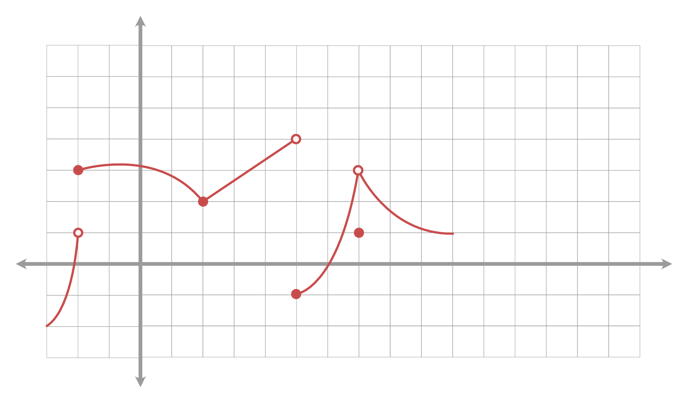

+ $\lim\limits_{x \to -2^{-}} f(x) = 1$
+ $\lim\limits_{x \to -2^{+}} f(x) = 3$
+ $\lim\limits_{x \to -2} f(x) \text{ no existe}$
+ $\lim\limits_{x \to 2^{-}} f(x) = 2$
+ $\lim\limits_{x \to 2^{+}} f(x) = 2$
+ $\lim\limits_{x \to 2} f(x) = 2$
+ $\lim\limits_{x \to 5^{-}} f(x) = 4$
+ $\lim\limits_{x \to 5^{+}} f(x) = -1$
+ $\lim\limits_{x \to 5} f(x) \text{ no existe}$

### Límites infinitos  <small>[:arrow_heading_up:](#index)</small>

Algunas veces el límite podría ser infinito (el límite no existe):

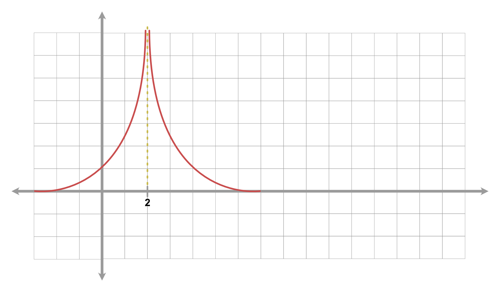

+ $\lim\limits_{x \to 2^{-}}f(x) = \infin$ (no existe)
+ $\lim\limits_{x \to 2^{+}}f(x) = \infin$ (no existe)
+ $\lim\limits_{x \to 2}f(x) = \infin$ (no existe)

### Límites al infinito  <small>[:arrow_heading_up:](#index)</small>

Cuando la variable $x$ crece (o decrece) arbitrariamente, el comportamiento del límite puede variar.

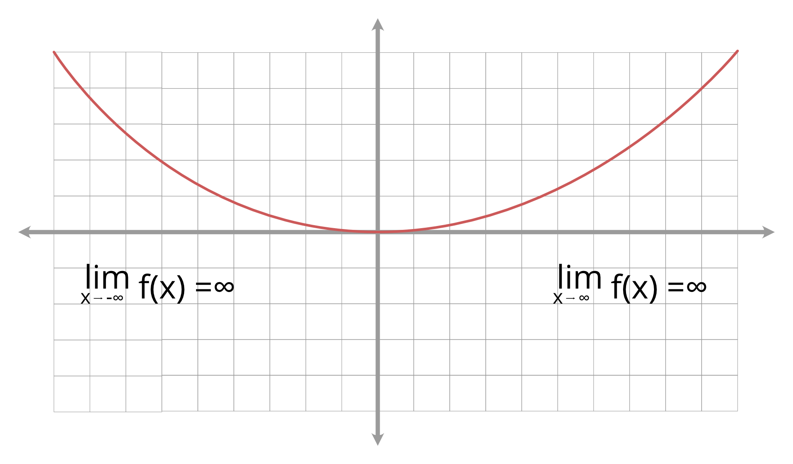

### Límites importantes  <small>[:arrow_heading_up:](#index)</small>

Algunos límites de funciones importantes en cálculo son:

+ $\lim\limits_{x \to \infin} sen(x)$ no existe
+ $\lim\limits_{x \to -\infin} sen(x)$ no existe
+ $\lim\limits_{x \to \infin} cos(x)$ no existe
+ $\lim\limits_{x \to -\infin} cos(x)$ no existe
+ $\lim\limits_{x \to -\infin} e^{x} = 0$
+ $\lim\limits_{x \to \infin} e^{x} = \infin$

> $\lim\limits_{x \to \infin} {1 \over x^{n}} = 0$ dónde $n \in \Bbb{Q} y x^{n}$ está definido. 
> Recurso mnemotécnico: ${1 \over \infin} = 0$

## Continuidad   <small>[:arrow_heading_up:](#index)</small>

La idea de un trazo continuo es el de aquel que se realiza sin levantar el lápiz; no tiene huecos ni saltos. Esta idea se puede llevar a las funciones y sus gráficas.

Una función $f$ es **continua** en el punto $x = a$ si $\lim\limits_{x \to a} f(x) = f(a)$

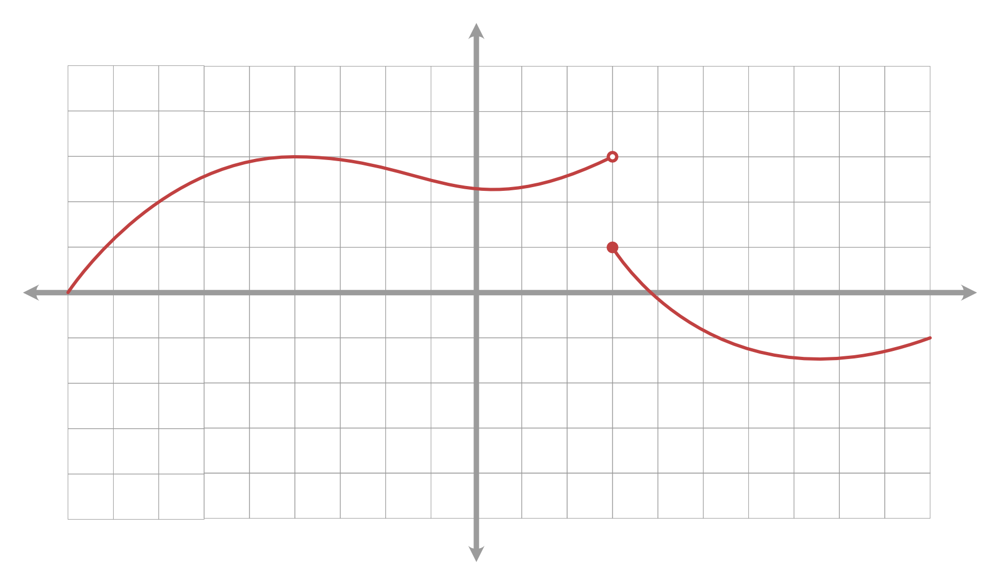

> **No es continua** (Discontinuidad de salto)

Una función es continua en un intervalo $(a,b)$ si es continua en todo punto de ese intervalo.

**Ejemplos de funciones continuas:**
+ **Constantes.** Son continuas en todo $\Bbb{R}$. Ejemplo $f(x) = 5$
+ **Polinomios.** Son continuos en todo $\Bbb{R}$. Ejemplo $f(x) = 3x^{2} + x - 3$
+ **Exponenciales.** Son continuas en todo $\Bbb{R}$. Ejemplo $f(x) = e^{x}$
+ **Logarítmicas.** Son continuas en su Dominio. Ejemplo $f(x) = ln(x)$
+ **Trigonométricas.** Son continuas en su Dominio. Ejemplo $f(x) = cos(x)$
+ **Racionales.** Son continuas en su Dominio. Ejemplo $f(x) = {x^{2} + x + 1 \over x - 2}$

> **Teorema:** La suma, la resta, la multiplicación, división, y composición de funciones continuas es continua.

# Unidad 3  <small>[:arrow_heading_up:](#index)</small>

Objetivos de la unidad

<markdown>
Resuelve los problemas matemáticos mediante la aplicación de diferenciación de funciones con el uso de los diferentes registros de representación mediante herramientas tecnológicas.
</markdown>

## Derivación  <small>[:arrow_heading_up:](#index)</small>

### Definición de derivada  <small>[:arrow_heading_up:](#index)</small>

La **derivada** de una función (en un punto) es un número, que resulta de la aplicación de cierto límite. En los siguientes subtemas veremos *cómo calcularlo más fácilmente*, y más adelante, *cómo se interpreta* ese número.

Si $f(x)$ es una función, entonces la **derivada** de $f(x)$ en el punto $a$ se define así:

$$
f'(a) = \lim\limits_{h \to 0} {f(a+h)-f(a) \over h}
$$

o así:

$$
f'(a) = \lim\limits_{t \to a} {f(t) - f(a) \over t - a}
$$

**Ejemplo:** si $f(x) = x^{2}$ podemos calcular la derivada de $f(x)$ en el punto $4$ con la primera fórmula:

$$
\begin{aligned}
f'(4) &= \lim\limits_{h \to 0} {f(4 + h) - f(4) \over h} \\
&= \lim\limits_{h \to 0} {(4+h)^{2} - (4)^{2} \over h} \\
&= \lim\limits_{h \to 0} {h^{2} + 8h + 16 - 16 \over h} \\
&= \lim\limits_{h \to 0} {h^{2} + 8h \over h} \\
&= \lim\limits_{h \to 0} {\cancel{h}(h+8) \over \cancel{h}} \\
&= \lim\limits_{h \to 0} {(h+8)=8}
\end{aligned}
$$

> Si lo hubiéramos resuelto con la otra fórmula llegaríamos al mismo resultado.

### Cálculo de la derivada con fórmulas  <small>[:arrow_heading_up:](#index)</small>

Dada una función $f(x)$, el cálculo de la derivada $f'(a)$ es complicado porque se tiene que resolver un límite. Por ejemplo, si $f(x) = x^{2} + cos(x)$ y se deseara calcular $f'(2)$, tendríamos que resolver el límite:

$$
f'(2) = \lim\limits_{h \to 0} {f(2+h)-f(2) \over h} = \lim\limits_{h \to 0} {(2+h)^{2} + cos(2+h) - (4 + cos(2)) \over h} = \text{ ?}
$$

Pero hemos notado que si $f(x) = x^{2}$ entonces:

$$
f'(-2) = \lim\limits_{h \to 0} {f(2 + h) - f(2) \over h} = \dots = -4 \\
f'(0) = \lim\limits_{h \to 0} {f(0 + h) - f(0) \over h} = \dots = 0 \\
f'(4) = \lim\limits_{h \to 0} {f(4 + h) - f(4) \over h} = \dots = 8 \\
f'(6) = \lim\limits_{h \to 0} {f(6 + h) - f(6) \over h} = \dots = 12 \\
f'(10) = \lim\limits_{h \to 0} {f(10 + h) - f(10) \over h} = \dots = 20
$$

> Podemos preguntarnos: Si $f(x) = x^{2}$, ¿$f'(a)$ siempre será el número doble, es decir $2a$?

### Fórmulas de derivación  <small>[:arrow_heading_up:](#index)</small>

| Función | Derivada |
| :-----: | :------: |
| $f(x) = c$ | $f'(x) = 0$ |
| $f(x) = x$ | $f'(x) = 1$ |
| $f(x) = x^{2}$ | $f'(x) = 2x$ |
| $f(x) = x^{3}$ | $f'(x) = 3x^{2}$ |
| $f(x) = x^{n}$ | $f'(x) = nx^{n-1}$ |
| $f(x) = \sqrt{x}$ | $f'(x) = {1 \over 2 \sqrt{x}}$ |
| $f(x) = sen(x)$ | $f'(x) = cos(x)$ |
| $f(x) = cos(x)$ | $f'(x) = -sen(x)$ |
| $f(x) = tan(x)$ | $f'(x) = sec^{2}(x)$ |
| $f(x) = e^{x}$ | $f'(x) = e^{x}$ |
| $f(x) = ln(x)$ | $f'(x) = {1 \over x}$ |

### Reglas de derivación  <small>[:arrow_heading_up:](#index)</small>

Las fórmulas de derivación anteriores son importantes, pero no son suficientes pues no podríamos conocer la derivada de la función $f(x) = x^{2} + sen(x)$.

En este momento introducimos una nueva notación para la derivada:

$$
f' = {df \over dx} \iff f'(x) = {df \over dx}(x)
$$

Usamos esta notación nueva para expresar las siguientes **reglas de derivación:**

$$
{d \over dx}[cf] = c({df \over dx})
$$

$$
{d \over dx}[f + g] = {df \over dx} + {dg \over dx}
$$

$$
{d \over dx}[f - g] = {df \over dx} - {dg \over dx}
$$

$$
{d \over dx}[fg] = ({df \over dx})(g) + ({dg \over dx})(f)
$$

$$
{d \over dx}[{f \over g}] = {({df \over dx})(g) - ({dg \over dx})(f) \over (g)^{2}}
$$

$$
{d \over dx}[f(g(x))] = f'(g(x))g'(x)
$$

### Cálculo de derivadas  <small>[:arrow_heading_up:](#index)</small>

**Ejemplo:** Si $f(x) = 5$, hallar la derivada.

$$
f'(x) = 0
$$

**Ejemplo:** Si $f(x) = 6tan(x)$, hallar la derivada.

$$
f'(x) = 6sec^{2}(x)
$$

**Ejemplo:** Si $f(x) = x^{2} + sen(x)$, hallar la derivada.

$$
f'(x) = 2x + cos(x)
$$

**Ejemplo:** Si $f(x) = cos(x) - e^{x}$, hallar la derivada.

$$
f'(x) = -sen(x) - e^{x}
$$

**Ejemplo:** Si $f(x) = x^{2}sen(x)$, hallar la derivada.

$$
f'(x) = (2x)sen(x) + cos(x)x^{2}
$$

**Ejemplo:** Si $f(x) = {x^{2} \over sen(x)}$, hallar la derivada.

$$
f'(x) = {(2x)sen(x) - cos(x)x^{2} \over sen^{2}(x)}
$$

### Fórmulas adicionales de derivación  <small>[:arrow_heading_up:](#index)</small>

| Función | Derivada |
| :-----: | :------: |
| $f(x) = a^{x}$ | $f'(x) = a^{x}ln(a)$ |
| $f(x) = log_{a}(x)$ | $f'(x) = {1 \over x}log_{a}(e) = {1 \over xln(a)}$ |
| $f(x) = cot(x)$ | $f'(x) = -csc^{2}(x)$ |
| $f(x) = sec(x)$ | $f'(x) = sec(x)tan(x)$ |
| $f(x) = csc(x)$ | $f'(x) = -csc(x)cot(x)$ |
| $f(x) = arcsen(x)$ | $f'(x) = {1 \over \sqrt{1 - x^{2}}}$ |
| $f(x) = arccos(x)$ | $f'(x) = {-1 \over \sqrt{1 - x^{2}}}$ |
| $f(x) = arctan(x)$ | $f'(x) = {1 \over 1 + x^{2}}$ |
### Interpretación de la derivada  <small>[:arrow_heading_up:](#index)</small>

La derivada es un *número* que se puede interpretar de dos maneras:

+ **Pendiente de recta tangente**

+ **Razón de cambio instantánea**

### La derivada como pendiente de recta tangente  <small>[:arrow_heading_up:](#index)</small>

La **pendiente** de una recta es un número $m \in R$ que nos indica qué tan inclinada está dicha recta.

De hecho, $m = tan(\theta)$, donde $\theta$ es el ángulo con el eje $X$.

> Una recta vertical no tiene pendiente (su pendiente sería $\infin$)

> Si $f(x)$ es una función, entonces su derivada en el punto $a$ es precisamente la pendiente que tiene la recta tangente a la gráfica de $f(x)$ sobre el punto $x = a$

### La derivada como razón de cambio  <small>[:arrow_heading_up:](#index)</small>

### Regla de la cadena  <small>[:arrow_heading_up:](#index)</small>

### Derivación Implícita  <small>[:arrow_heading_up:](#index)</small>

### Derivadas de orden superior  <small>[:arrow_heading_up:](#index)</small>

### Regla de L'Hopital  <small>[:arrow_heading_up:](#index)</small>
 
### Teorema de Rolle  <small>[:arrow_heading_up:](#index)</small>

### Teorema del valor medio  <small>[:arrow_heading_up:](#index)</small>

